AWorks SDK开发
=======================================

下面简单介绍一下在eclipse中使用 ``aworks_m105x_sdk_x.x.x-alpha`` 软件包在M105x_EV_Board开发板上进行应用程序开发的常见操作，
如工程导入与新建，编译及调试。约定在本文中的 aworks_m105x_sdk_x.x.x-alpha 软件包简称为 SDK，并以{SDK}代表该软件包的根目录。

.. attention::
  在开始工作前，首先将 ``aworks_m105x_sdk_x.x.x-alpha`` 软件包拷贝到非中文目录下 ，否则在调试时调试工具链可能会找不到源文件。

打开eclipse并建立工作空间
***************************

首次使用eclipse进行开发时，需要建立合适的工作空间。一个Eclipse可以有多个工作空间，每个工作空间包含了多个项目，以及设置信息，
例如：界面布局，文字大小，服务器定义等等，应当注意的是，用户在删除工作空间目录的时候，将会删除该工作空间的所有设置信息，
也可能误删位于工作空间中的项目文件。

找到解压后的eclipse开发环境软件包目录，点击“startup_eclipse_neon.bat”批处理启动eclipse软件，如 :numref:`a_picture_eclipse_startup` 所示：

.. _a_picture_eclipse_startup:

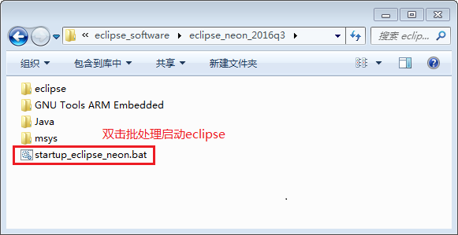

   双击批处理启动eclipse软件

如果第一次打开Eclipse或者打开后没有勾选默认工作空间，软件会自动弹出默认工作空间界面，点击 **【Browse】** 选择eclipse的工作空间，在本文档中将路径设置在“E:\WorkSpace\rt1052”，用户可自行决定路径位置。

.. attention::

   自己选择的工作空间路径不要有中文,可以避免路径识别问题

如果不需要更改工作空间，勾选上图中红色框中的内容即可。然后点击 **【OK】** 选项，如 :numref:`a_picture_eclipse_workspace` 所示。

.. _a_picture_eclipse_workspace:

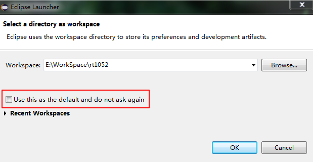

   建立工作空间

打开一个Eclipse只能使用一个工作空间，打开多个Eclipse可以使用多个工作空间，一个工作空间可以有多个项目。另外，同一个项目也可以
加入到不同的工作空间中，在工作空间目录下有一个名为.metadata的目录来保存所有设置信息，如 :numref:`metadata` 所示。

.. _metadata:

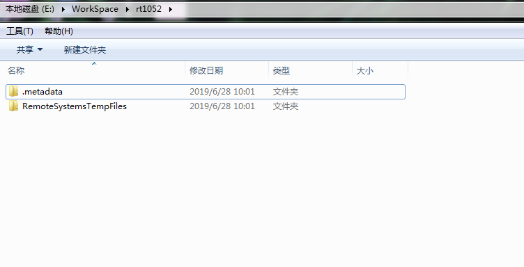
   
   设置信息

工作空间建立完成后，会进入eclipse界面，如 :numref:`a_picture_eclipse_welcome` 所示。 

.. _a_picture_eclipse_welcome:

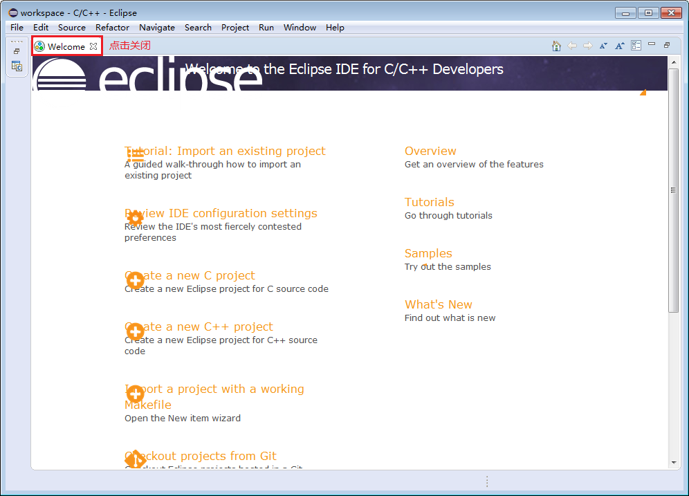

   首次进入eclipse显示界面

根据 :numref:`a_picture_eclipse_welcome` 中的提示，点击关闭 **【Welcome】** ，点击后会自动打开左侧的 **【Project explorer】** 选项框，
如 :numref:`a_picture_eclipse_null_project` 所示。

.. _a_picture_eclipse_null_project:

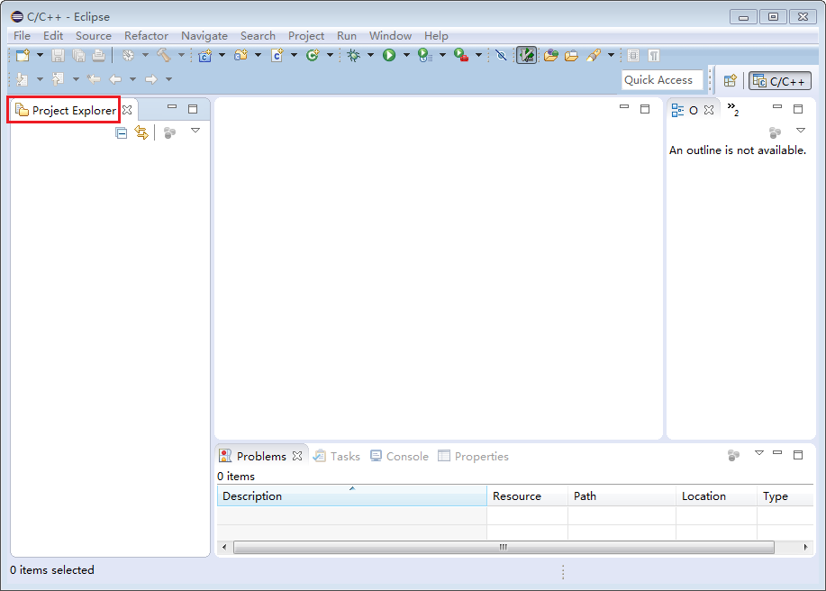

   Eclipse显示界面

.. _name_one:

导入SDK模版工程
**********************

用户想使用SDK包开发，首先需要导入模版工程，模版工程位于 **{SDK}\\projects** 目录下面。
如 :numref:`a_picture_project_path` 所示，“img_rt1050_debug”为模板工程。

.. _a_picture_project_path:

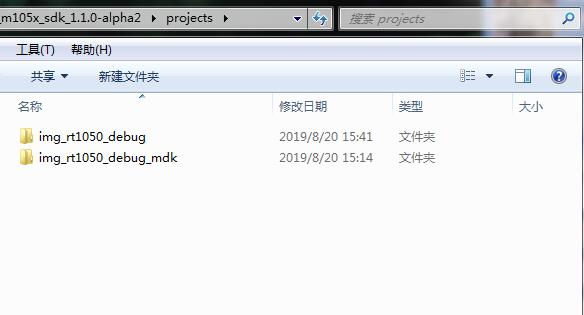

   模板工程路径

在 :numref:`a_picture_eclipse_null_project` 所标记的 **【Project explorer】** 选项框下面空白处右击后，弹出如 :numref:`a_picture_start_import` 所示的界面。

.. _a_picture_start_import:

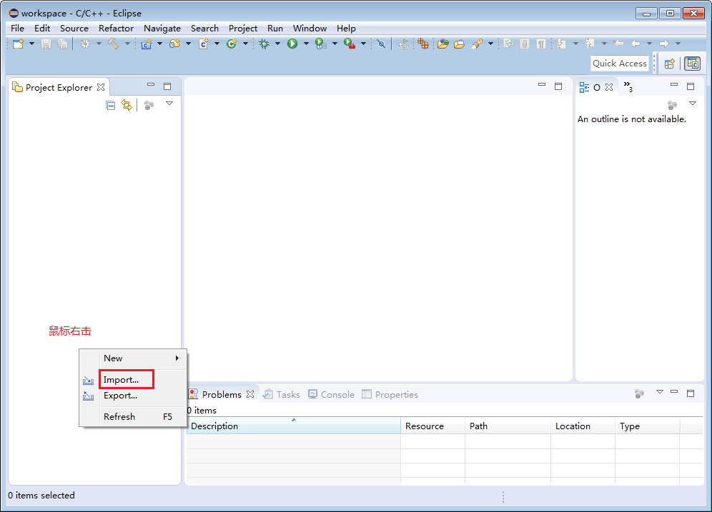

   弹出导入工程对话框

在鼠标右击弹出如 :numref:`a_picture_start_import` 所示的对话框后，依次
点击“Import”->“General”->“Existing Projects into Workspace”->“Next”->“Select root directory”->“Browse”，
选择该SDK包中的模版工程，填入模版工程的路径为“{SDK}\\projects\\img_rt1050_debug”，会依次显示如  :numref:`a_picture_import_prj` ， :numref:`a_picture_slect_import` 所示的界面。

.. _a_picture_import_prj:

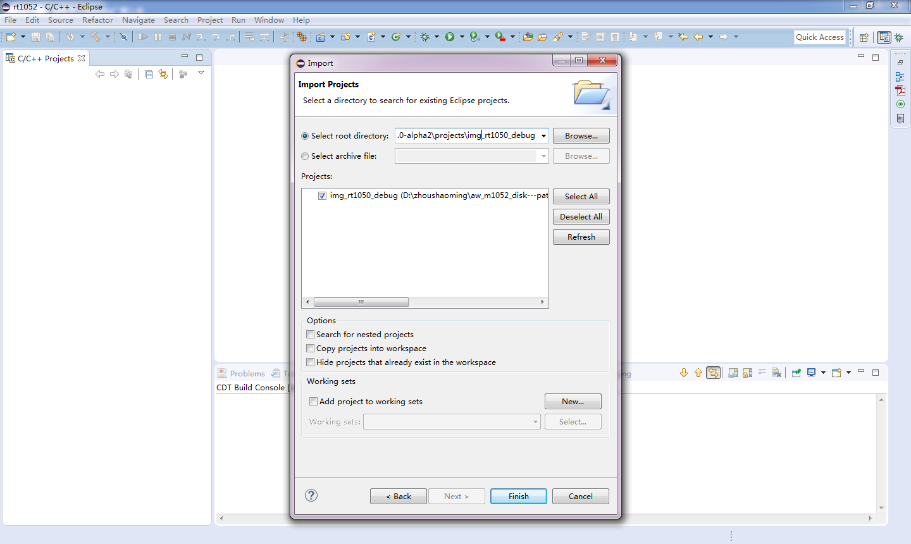

   导入工程 

.. _a_picture_slect_import:

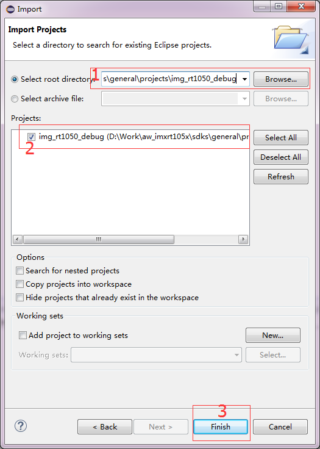

   选择待导入的工程

点击 :numref:`a_picture_slect_import` 的 **【Finish】** 即可完成导入操作，导入后界面如 :numref:`a_picture_import_ok` 所示。

.. _a_picture_import_ok:

.. figure:: ./images/3/成功导入SDK模版工程.png
   :align: center

   成功导入SDK模版工程

在 :numref:`a_picture_import_ok` 中双击模版工程，模版工程目录结构如 :numref:`a_picture_project_dir_struct` 所示,不同版本的SDK包目录结构可能有些不同。

.. _a_picture_project_dir_struct:

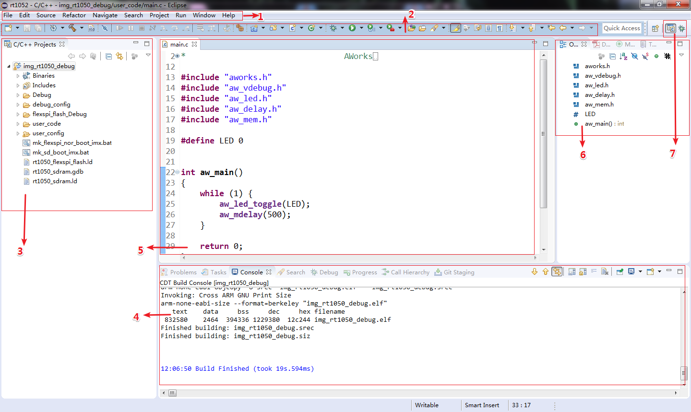

   SDK模版工程目录结构

在SDK模版工程目录结构中：

* 1-主菜单：包含文件、编辑、源代码、重构、搜索、工程、运行、窗口与帮助等菜单;

* 2-工具栏：包含文件工具栏、调试、运行、搜索、浏览工具栏等;

* 3-资源管理器视图：用于显示项目中源文件、文本信息、配置信息等；

* 4-问题视图：包含了调试编译错误警告的具体信息等；

* 5-编辑区间：在此区间内编辑代码；

* 6-文件目录：显示了当前.C件所关联的文件；

* 7-编辑与调试界面：点击左边为当前编辑界面、右边为Debug时界面；

在界面中所显示界面并不是无法改变的，用户可自行拖拽更改所在位置、也打开或关闭一些其他视图，IDE会记忆当前界面的改变。

项目：Eclipse中所有的可以编译运行的资源必须放在项目中，单独打开文件很多功能不可用，项目表示了一系列相关的文件和设置（例如类、路径、编译器级别、发布路径等等的设置）
一般来说目录下的.project描述了当前项目的信息。

如果用户在工作空间不需要这个项目，可选择Edit->Delete或选择工程单击右键选择Delete删除工程，若需要关闭该项目则可以打开项目先选中单个或者多个项目，
然后选择Project-->Close Project,或者单击右键选择菜单Close Project。

.. _.compile_project:

编译SDK模版工程
********************
如 :numref:`a_picture_buid_sdk` 所示，首先选中左侧的工程，然后点击【编译】按钮 |a_picture_compile_pulldown| 的下拉菜单，将显示出六种编译模式，在六种编译模式中:

* Debug和flexspi_flash_Debug模式下编译代码不会进行优化，编译产生的目标文件最大，此种模式常用于调试代码；
* MinSizeRel和flexspi_flash_MinSizeRel模式下编译代码会进行编译优化和链接优化，生成的目标文件最小；
* Release和flexspi_flash_Release模式为无调试信息的发行版；

其中Debug、MinSizeRel、Release三种编译模式编译出来的程序可以运行在SDRAM上，flexspi_flash_Debug、flexspi_flash_MinSizeRel、
flexspi_flash_Release这三种编译模式编译出来的程序可以运行在QSPI Flash上，用户可根据需求选择需要的编译模式。

以Debug编译模式为例，点击 :numref:`a_picture_buid_sdk` 中3处的Debug选项，编译工程。

.. _a_picture_buid_sdk:

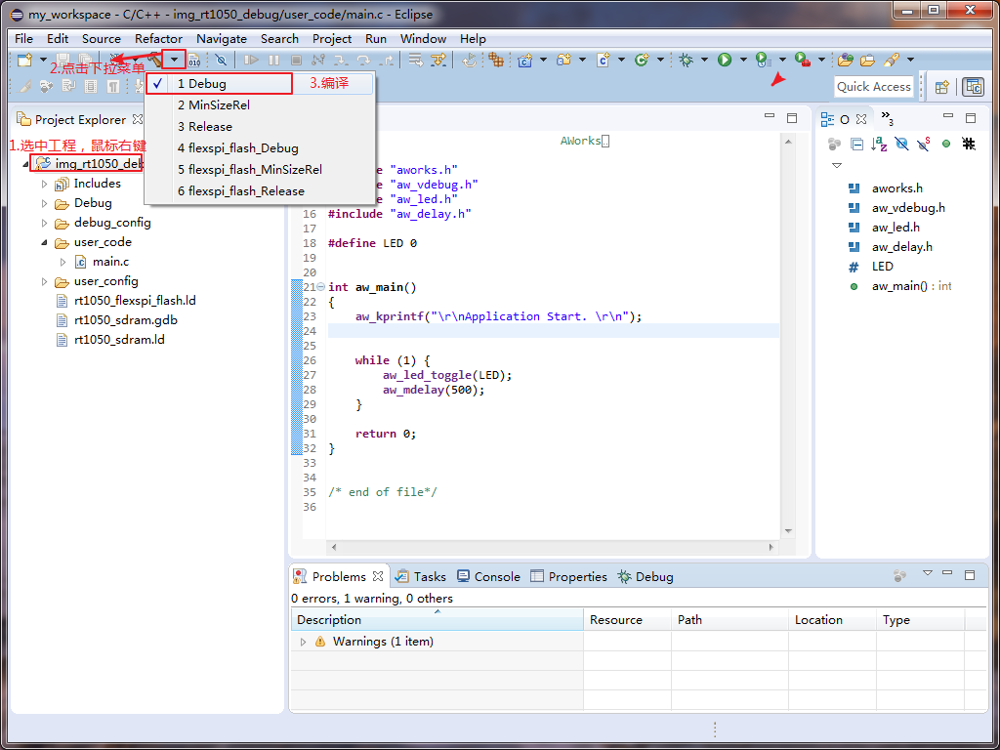

   编译SDK工程

点击编译按钮后，工程进入编译中，出现如 :numref:`a_picture_buiding_sdk` 所示进度条。在 :numref:`a_picture_buiding_sdk` 中的【Console】窗口，可以查看编译信息，在【Console】窗口可以查看错误警告信息。

.. _a_picture_buiding_sdk:

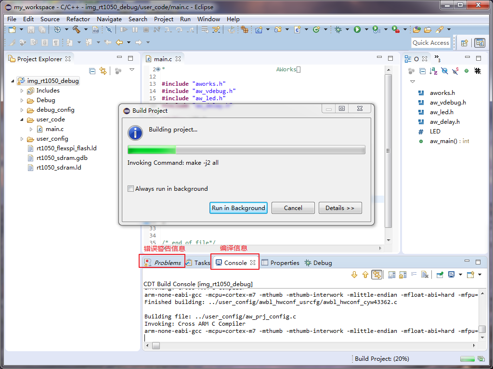

   编译进行中

工程编译成功后 如 :numref:`a_picture_buid_sdk_complete` 所示，生成“img_rt1052_debug.elf”文件。

.. _a_picture_buid_sdk_complete:

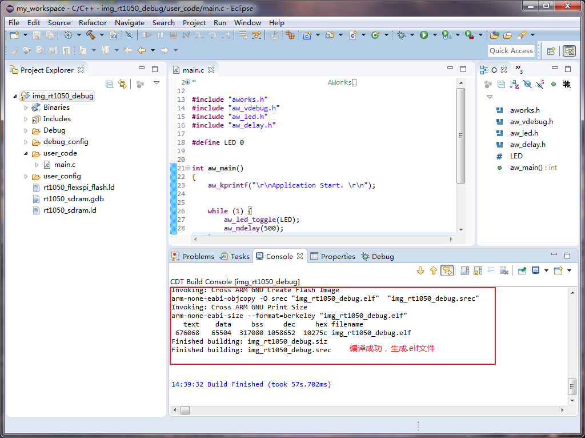

   编译成功

同时在工程目录下会生成一个Debug目录，在Debug目录下可以看到已成功生成“img_rt1052_debug.elf”文件，如 :numref:`a_picture_buid_target_dir` 所示：

.. _a_picture_buid_target_dir:

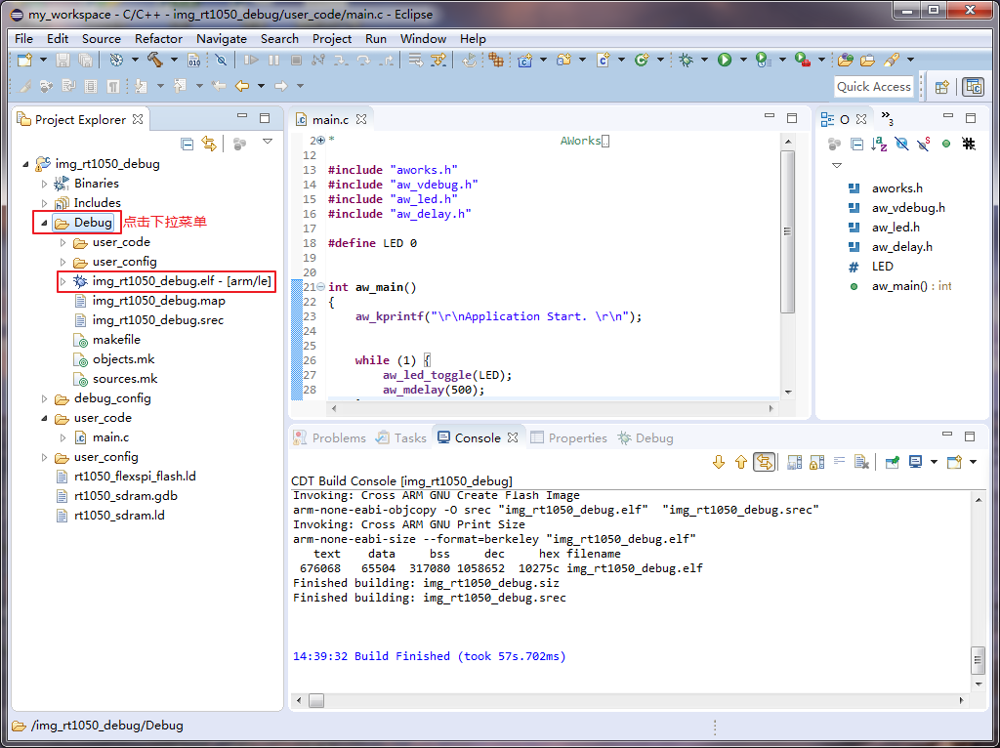

   生成Debug目录

如果编译成功后，在Debug目录下没有看到“img_rt1052_debug.elf”文件，选中Debug目录，鼠标右键刷新，如 :numref:`a_picture_refresh_debug_dir` 所示。刷新完成后，将看到 :numref:`a_picture_buid_target_dir` 所示“img_rt1052_debug.elf”文件。

.. _a_picture_refresh_debug_dir:

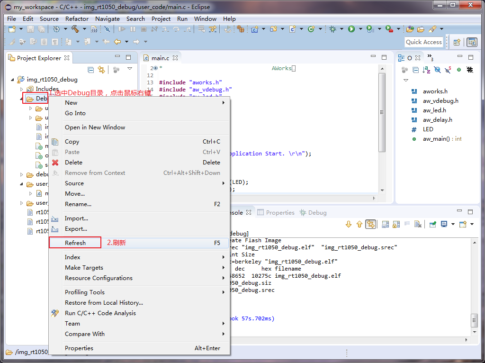

   刷新Debug目录

.. _.debug_easy_arm_project:

    
调试SDK模版工程
*******************

.. _3.4.2:

调试配置
----------

调试前，需要进行配置(配置只需要一次)，在SDK中已经进行了工程调试的配置，选择 |a_picture_debug_menu| 的下拉菜单，便可以看到已经配置完成了的调试，如 :numref:`a_picture_find_dubug_conf` 所示。

.. _a_picture_find_dubug_conf:

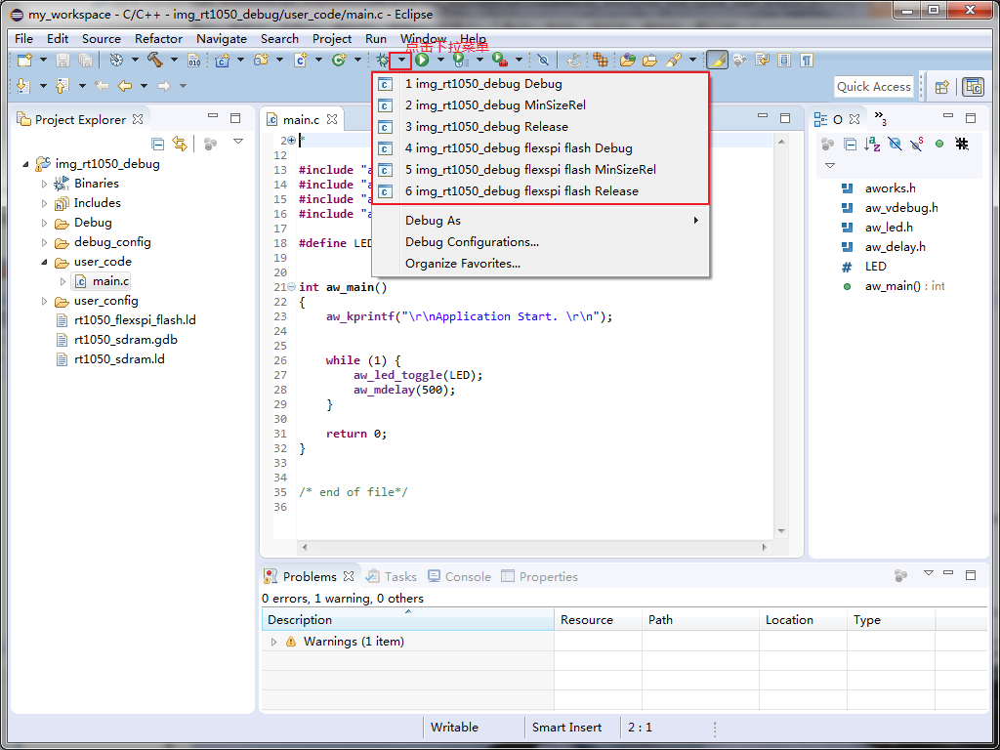

   查看调试的配置

如果如 :numref:`a_picture_slect_dubug_conf` 所示，没有看到调试的配置，则是由于Eclipse的BUG造成，要重新关闭工程再打开工程，参照下面步骤操作即可。如果可以看到配置选项可跳过下面的操作步骤。

.. _a_picture_slect_dubug_conf:

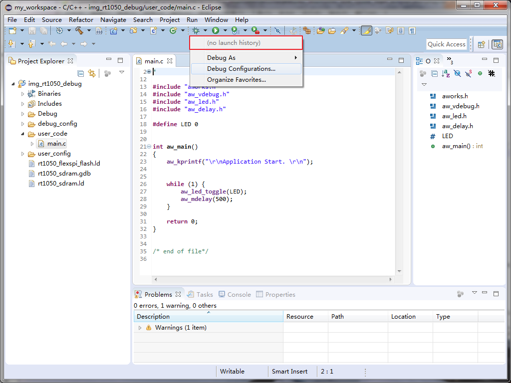

   无调试配置

1、在工程名单击鼠标右键，点击【Close Project】关闭工程，如 :numref:`a_picture_close_project` 所示；

.. _a_picture_close_project:

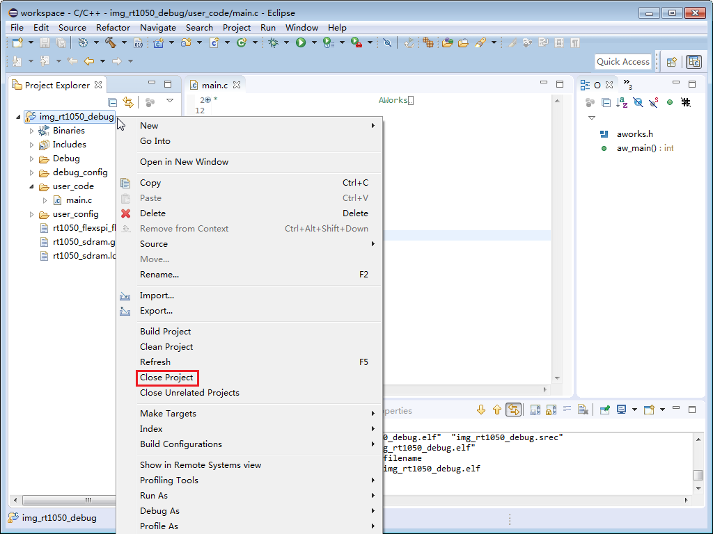

   关闭工程

2、然后在工程名单击鼠标右键，点击【Open Project】再次打开工程，如 :numref:`a_picture_open_project` 所示；

.. _a_picture_open_project:

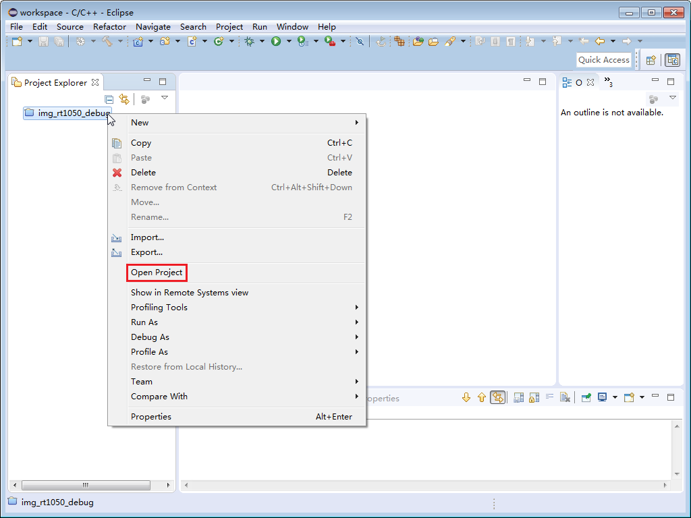

   打开工程

再次选择 |a_picture_debug_menu| 的下拉菜单，就可以看到SDK工程中已经加载了六种调试配置选项，

.. attention::
    在SDK工程目录下的debug_config文件夹下保存了Debug、MinSizeRel、Release、flexspi flash Debug、 flexspi flash MinSizeRel、flexspi flash Release六种调试配置，用户在导入工程之后，这六种配置将自动生效，可以直接点击 |a_picture_debug_menu| 上的 |a_picture_debug_browser| 进行调试配置的选择。    

.. _3.4.3: 

连接仿真器
-------------------

J-Link仿真器支持JTAG与SWD两种调试接口，本文中M105x_EV_Board开发板使用的是SWD调试接口，它们引脚的对应关系如 :numref:`a_picture_jlink_swd` 所示。

.. _a_picture_jlink_swd:

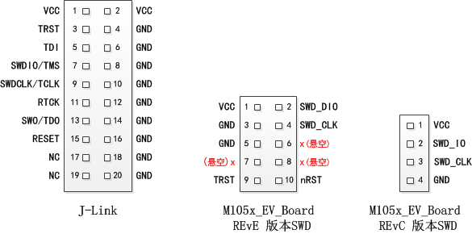

   J-Link与SWD引脚关系对应图

查看开发板底板上的版本号，按照 :numref:`a_picture_jlink_swd` 中SWD引脚根据名称对应连接到J-Link 引脚当中，仿真器就能正确识别出芯片内核与ID了。

.. attention::
   本文中使用的仿真器为J-Link V9。

启动方式配置
-------------------

M105x_EV_Board开发板J10模块（启动方式配置模块）如 :numref:`a_picture_WDG` 所示，调试下载前，用跳线帽短接CFG6和WDG。

.. _a_picture_WDG:

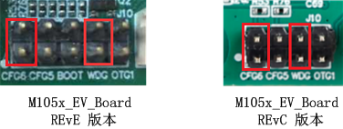

   启动模式配置

.. attention::
  如果选择下载程序到flash，下载完成后重启时必须拔掉CFG6上的条线帽，并在下次调试下载时再次插上跳线帽。

目标板上电
-------------------
正确连接好J-Link仿真器后，使用外接的9-12V电源为M105x_EV_Board开发板供电。

启动GDB Server
-------------------

启动 GDB Server 有两种方式，可以选择启动外部GDB Server，也可以配置从eclipse内部启动GDB Server。

1.启动外部GDB Server

在启动GDB Server前将开发板硬件复位，在电脑的“所有程序”中找到J-Link调试软件，即“SEGGER”->“J-Link ARM V6.14b”->“J-Link GDB Sever”，打开后如 :numref:`a_picture_open_gdb_server` 所示：

.. _a_picture_open_gdb_server:

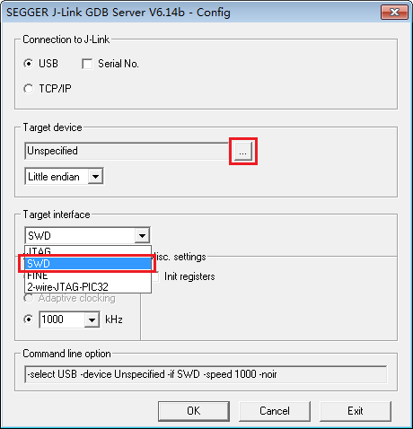

   启动GDB Server软件

在如 :numref:`a_picture_open_gdb_server` 所示的界面中，选择“Target interface”为“SWD”，然后点击“Target device”旁边的按钮选择开发板对应的设备型号，如 :numref:`a_picture_select_mcu` 所示：

.. _a_picture_select_mcu:

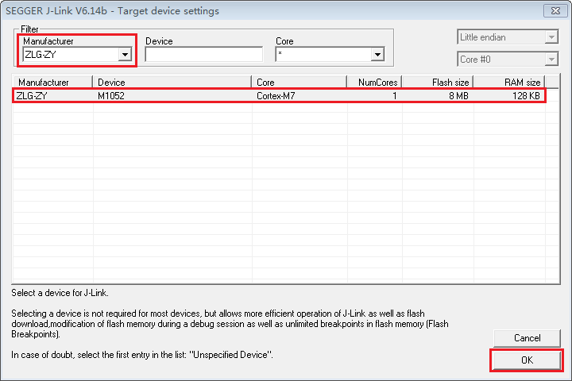

   选择对应设备型号

点击 **[Manufactuer]** 下拉框并找到“ZLG-ZY”并选择，下面的列表窗口中会出现一个“M1052”
设备，单击选中“M1052”后点击 **[OK]** 按钮返回GDB Server的配置界面，然后单击“OK”连接设备。如果出现如 :numref:`a_picture_gdb_server_connect` 所示界面，如果能检测到CPU的电压，说明GDB Server已经成功连接到目标板。

.. _a_picture_gdb_server_connect:

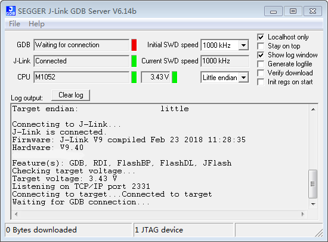

   成功连接到目标板界面

2.从eclipse内部启动GDB Server

点击 |a_picture_debug_menu| 的下拉菜单，选择【Debug Configurations...】选项，进入GDB启动配置，如 :numref:`a_picture_Debug_Configurations` 所示。

.. _a_picture_Debug_Configurations:

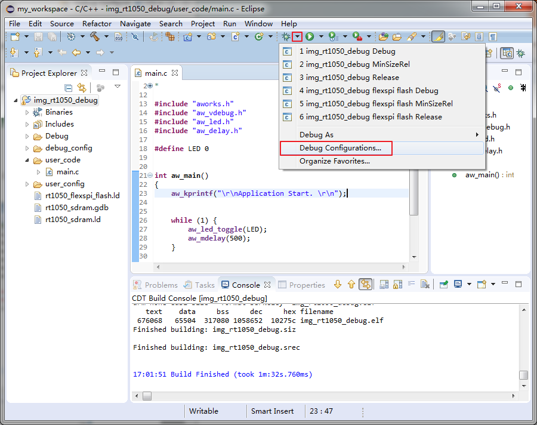

   Debug Configurations

进入【Debug Configurations】后，如 :numref:`a_picture_Debugging` 在【GDB SEGGER J-Link Debugging】选项下可看到六种调试模式，选择【img_rt1050_debug Debug】-> 【Debugger】，按照  :numref:`a_picture_Debugging` 配置【Debugger】页面。

.. _a_picture_Debugging:

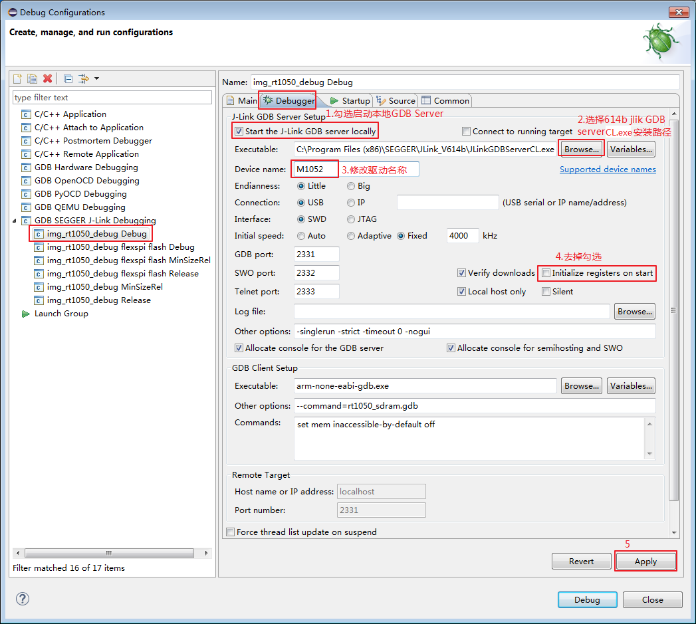

   Debugger页面配置

.. attention::
  这两种启动方式，用户任选其一即可，如果选择从eclipse内部启动GDB Server，则必须关闭外部GDB Server软件；如果选择启动外部GDB Server，则必须去掉 :numref:`a_picture_Debugging` 中1处的勾选。

启动调试
-------------------

**1.在SDRAM中调试**

在SDRAM中调试，程序被下载到SDRAM中运行，在elcipse界面中,先选择 **【Debug】** 编译选项编译程序后， 点击如 :numref:`a_picture_slect_dubug_elf` 所示的 |a_picture_debug_menu| 下拉菜单，选择 **【img_rt1050_debug Debug】** 调试项，程序开始下载到SDRAM。

.. _a_picture_slect_dubug_elf:

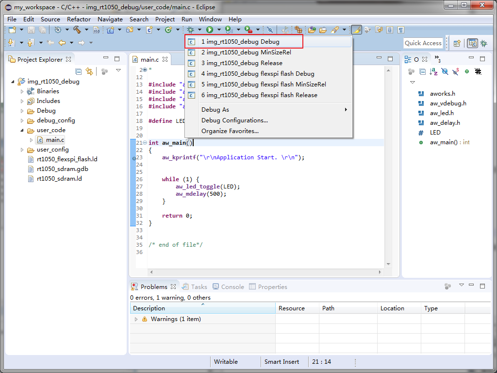

   选择SDRAM调试项

**2.在QSPI Flash中调试**

在QSPI Flash中调试，程序被下载到核心板上的QSPI Flash芯片上运行。先选择 **【flexspi_flash_Debug】** 编译选项编译程序后，点击如 :numref:`a_picture_slect_qspi_dubug_elf` 所示的 |a_picture_debug_menu| 拉菜单，选择 **【img_rt1050_debug flexspi flash Debug】** 调试项，程序开始下载到QSPI Flash。

.. _a_picture_slect_qspi_dubug_elf:

.. figure:: ./images/3/选择QPSI Flash调试项.png
   :align: center

   选择QSPI Flash调试项

程序下载到QSPI Flash的过程中，会弹出进度提示框，如 :numref:`a_picture_burn_progress` 所示。

.. _a_picture_burn_progress:

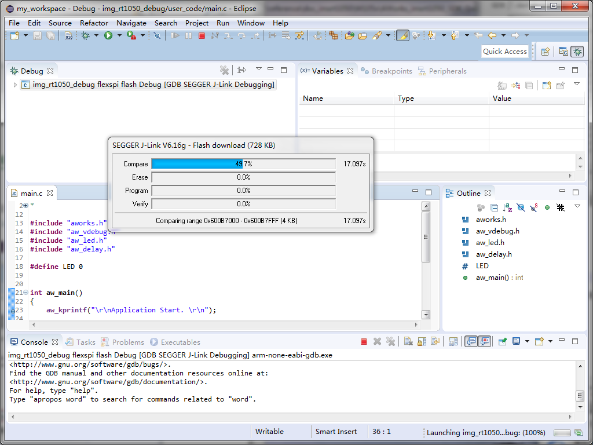

   下载进度提示

以在SDRAM中调试为例，程序下载完毕后，会跳出 :numref:`a_picture_confirm_switch` 所示界面，勾选【Remember my decision】选项，选择【Yes】进入调试界面，如 :numref:`a_picture_gdb_debuging` 所示。

.. _a_picture_confirm_switch:

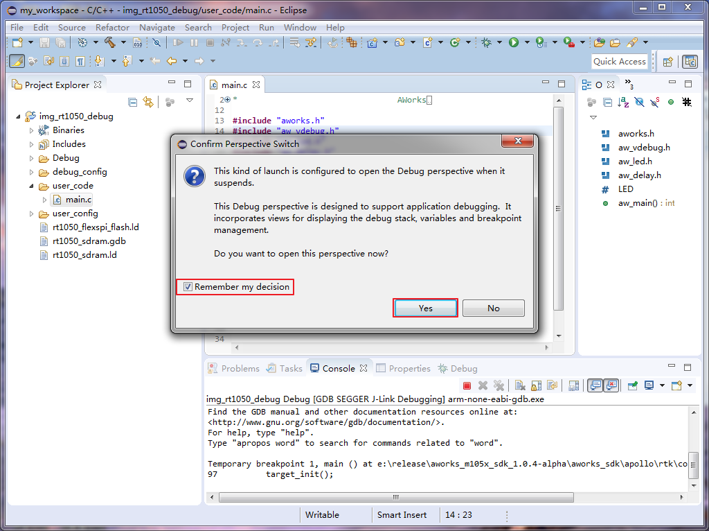

   选择进入调试界面

.. _a_picture_gdb_debuging:

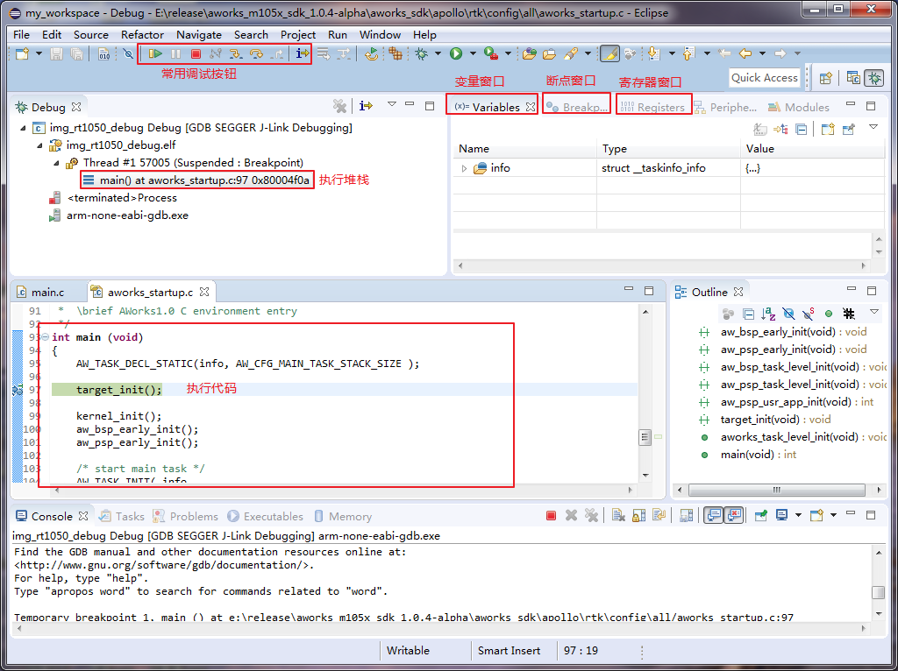

   调试界面

进入调试界面后，在 :numref:`a_picture_gdb_debuging` 中点击 **【通用寄存器窗口】** 标记处可以查看通用寄存器的信息，点击 **【断点窗口】** 标记处可以查看当前断点的设置信息。同时还可以使用以下常用的调试方法对应用程序进行调试：

1. 设置断点

在代码行左边空白处双击鼠标左键可以设置一个断点，设置成功后将出现一个蓝色小圆。如 :numref:`a_picture_set_break_point` 所示，在main.c这一个源文件的aw_main()函数里面为aw_kprintf()这一行代码设置了一个断点。 

.. _a_picture_set_break_point:

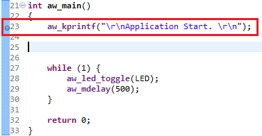

   设置断点

.. attention::
   所谓断点，即在进入调试模式后，程序运行至此时将自动暂停，再次双击即可取消断点。

2. 使用常用调试按钮

调试过程中，常常需要使用到的操作按钮，它们的作用如 :numref:`a_picture_debug_buttons` 所示。

.. _a_picture_debug_buttons:

   调试中使用到的操作按钮  

各按钮的含义如 :numref:`debug_button` 所示。

.. tabularcolumns:: |c|c|  

.. table:: 各调试按钮含义
   :name: debug_button
   :align: center

   +-----------------------+--------------------------------------------------------+
   | 按钮                  | 作用                                                   |
   +=======================+========================================================+
   | |a_picture_start|     | 全速运行(遇到断点或手动暂停时暂停程序)                 |
   +-----------------------+--------------------------------------------------------+
   | |a_picture_suspend|   | 暂停程序执行(只有当程序处于全速运行状态时有效)         |
   +-----------------------+--------------------------------------------------------+
   | |a_picture_stop|      | 停止并退出本次调试                                     |
   +-----------------------+--------------------------------------------------------+
   | |a_picture_steipinto| | 单步执行一行程序(遇到函数时，会进入函数继续单步执行)   |
   +-----------------------+--------------------------------------------------------+
   | |a_picture_stepover|  | 单步执行一行程序(遇到函数时，函数也被当做一行程序执行) |
   +-----------------------+--------------------------------------------------------+
   | |a_picture_stepexit|  | 运行程序至本函数退出                                   |
   +-----------------------+--------------------------------------------------------+
   | |a_picture_dissambly| | 调试时用于查看汇编代码                                 |
   +-----------------------+--------------------------------------------------------+

  

点击如 :numref:`a_picture_start` 所示的全速运行图标，程序便会开始全速运行，运行至断点设置处即会自动暂停，如 :numref:`a_picture_stop_break_point` 中红色方框标记部分所示。

.. _a_picture_start:

   全速运行  

.. _a_picture_stop_break_point:

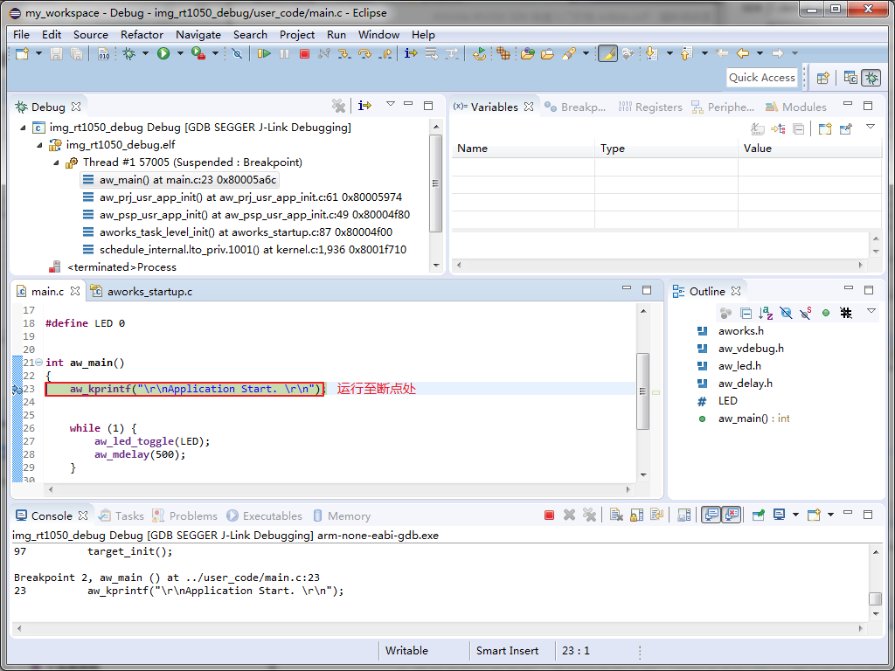

   运行至断点设置处 

如果想观察汇编代码，进行细致的分析，可以点击如 :numref:`a_picture_select_asm` 所示的汇编图标。

.. _a_picture_select_asm:

   选择查看汇编

点击汇编图标后，即可察看汇编代码在运行中显示的情况，如 :numref:`a_picture_asm_dispaly` 所示。

.. _a_picture_asm_dispaly:

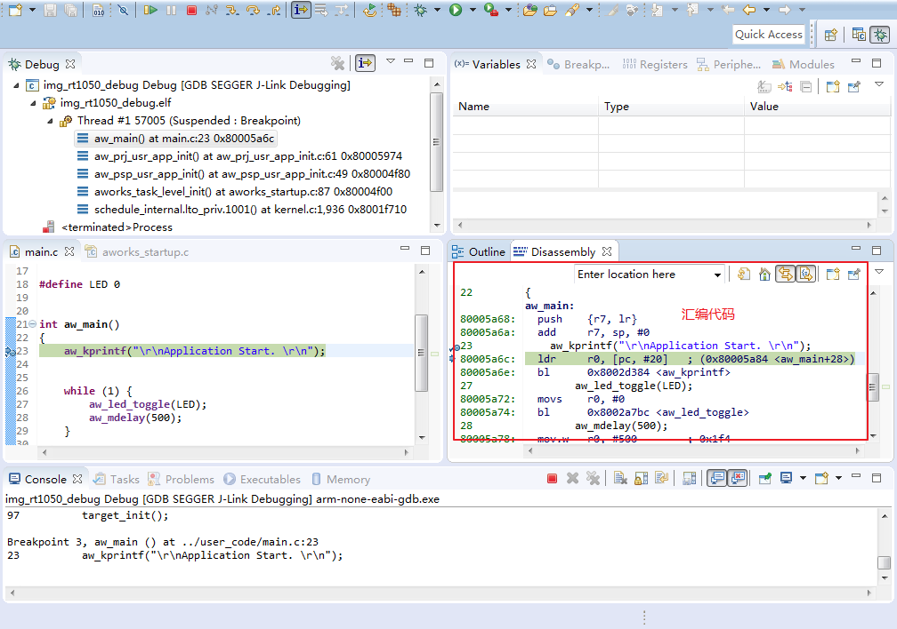

   汇编查看

然后，可以多次点击如 :numref:`a_picture_step_over` 所示的StepOver图标，观察程序的执行流程。

.. _a_picture_step_over:

   函数单步运行

停止调试
-------------------

若不再需要调试程序，则点击如 :numref:`a_picture_debug_stop` 所示的停止调试图标退出调试，停止调试后，GDB Server将停止连接。
    
.. _a_picture_debug_stop:

   退出调试

退出调试之后，可以点击 :numref:`a_picture_back_c` 中的小红色方框，可使其回到代码编辑窗口，即回到如 :numref:`a_picture_import_ok` 所示的界面。

.. _a_picture_back_c:

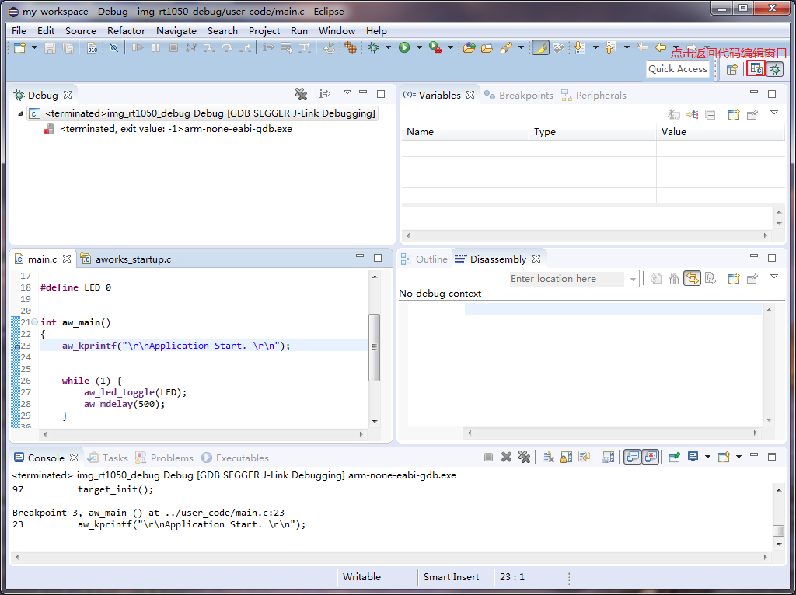

   返回代码编辑窗口

回到代码编辑窗口后，此时用户可以重新编辑修改代码，修改完成并重新编译通过后，可按照 :numref:`{number} <.debug_easy_arm_project>` 小节介绍的方法再一次进入调试.

.. attention::
     如果需要再次调试，在启动GDB Server前需要将开发板硬件复位。

   
从模版新建工程
********************

用户无需“从零”开始建立工程，这里可以通过以复制模板工程再粘贴的形式快
速创建新的工程，具体如下。

新建工程
--------

当模板工程正确导入eclipse之后，我们可以基于模板工程新建自己的工程。步骤如下：

1、首先在模版工程img_rt1050_debug同一级目录下建立一个名为led的空文件夹，如 :numref:`a_picture_lde_new` 所示。

.. _a_picture_lde_new:

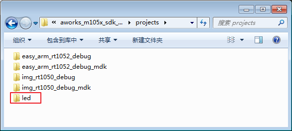

    建立led文件夹

2、然后在eclipse中选中模板工程img_rt1050_debug，并且右键单击弹出菜单，在菜单中选择 **【Copy】** 选项，复制当前工程，如 :numref:`a_picture_project_copy` 所示。

.. _a_picture_project_copy:

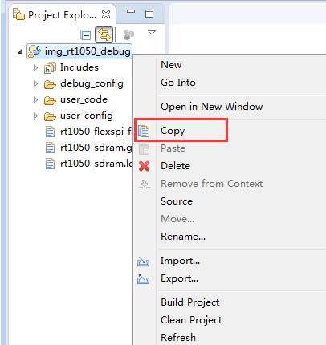

    复制模板工程

3、复制模板工程成功后，鼠标光标放在 **【Project explorer】** 选项框一侧的任意空白处，然后再右键单击弹出菜单，在菜单中选择 **【Paste】** 选项后，即可以粘贴新建一个工程，如 :numref:`a_picture_project_paste` 所示。

.. _a_picture_project_paste:

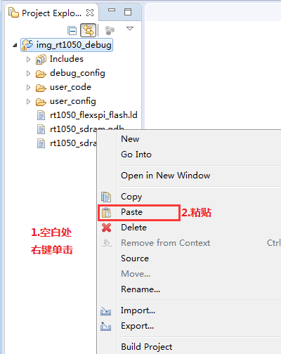

    粘贴新建一个工程

.. attention::
也可以使用复制快捷键 *Ctrl + C* 、粘贴快捷键 *Ctrl + V* 来新建工程。

4、在接下来弹出的对话框中，首先修改工程的名字，如命名为led；其次去掉勾选 **【Use default location】** ；再次，点击 **【Browse】** 选择刚刚新建的led目录“{SDK}\\projects\\led”存放新建工程；最后点击 **【OK】** 选项完成设置，如 :numref:`a_picture_project_set_path` 所示。

.. _a_picture_project_set_path:

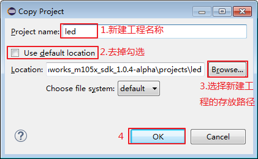

    设置新建工程的名字和保存路径

.. attention::
  新建工程的名字采用英文字母与阿拉伯数字表示且不带空格。新工程最好放在与模板工程 img_imx28x_debug 同级目录下面，这样可以不用设置工程的头文件路径之类的操作。

设置完成工程名字和保存路径之后，“{SDK}\\projects\\led”目录下会出现工程文件(这是自己的led工程文件)，如 :numref:`a_picture_sdk_led` 所示，

.. _a_picture_sdk_led:

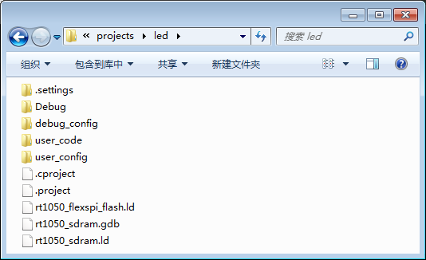

    SDK目录下新增的led文件夹

【Project explorer】选项框中会增加一个“led”的工程，如 :numref:`a_picture_project_create` 所示。

.. _a_picture_project_create:

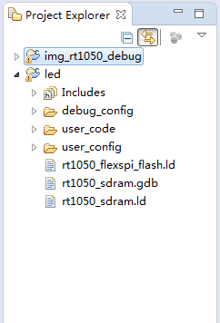

    Project explorer增加了新建的工程

led工程复制完成后，关闭【Project explorer】选项框中的模版工程，如 :numref:`a_picture_close_template` 。

.. _a_picture_close_template:

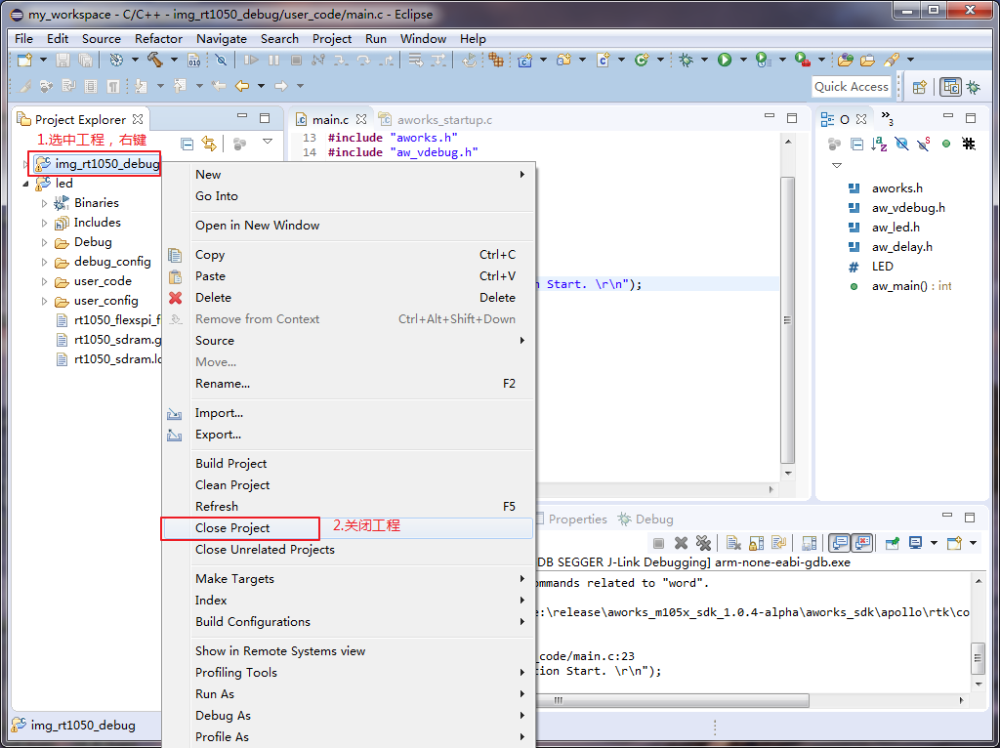

    关闭模板工程

修改工程的刷新策略
------------------

由于当前 led 工程是从模板工程复制粘贴来新建立的，它还会使用模板工程来作为刷新策略，因此 led 工程它的刷新策略需要变更为其自身。
依次点击  “Project”->“Properties”->“C/C++ Build” ->“Refresh Policy”，在显示的界面进行如 :numref:`a_picture_remove_refresh` 所示的操作。

.. _a_picture_remove_refresh:

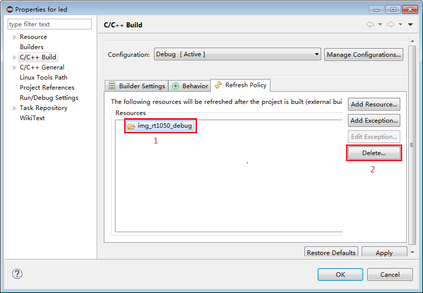

    移除模板工程的刷新策略

删除 led 工程基于模板工程的刷新策略后，添加基于 led 工程其自身的刷新策
略，具体操作如 :numref:`a_picture_add_refresh` 所示。

.. _a_picture_add_refresh:

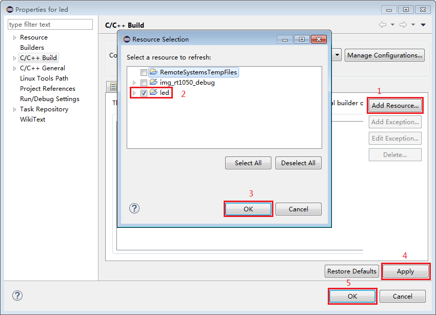

    变更led工程刷新策略为其自身

调试选项的配置
--------------

删除led工程中已有的调试配置，选中led工程“debug_config”目录下的“img_rt1050_debug Debug.launch”、“img_rt1050_debug MinSizeRel.launch”、“img_rt1050_debug Release.launch”、“img_rt1050_debug flexspi flash Debug.launch”、“img_rt1050_debug flexspi flash MinSizeRel.launch”、“img_rt1050_debug flexspi flash Release.launch”这六个文件并删除，如 :numref:`a_picture_del_launch` 所示。

.. _a_picture_del_launch:

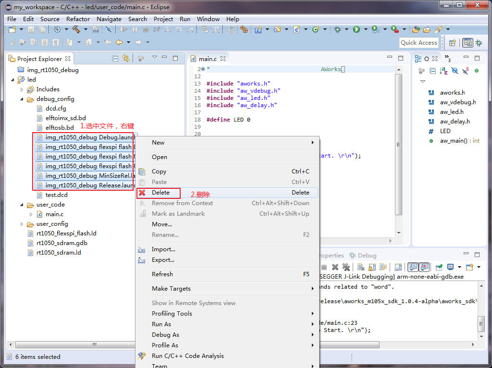

    删除调试配置文件

删除调试文件后，选中led工程中的Debug文件夹删除，如 :numref:`a_picture_led_debug_delete` 所示。

.. _a_picture_led_debug_delete:

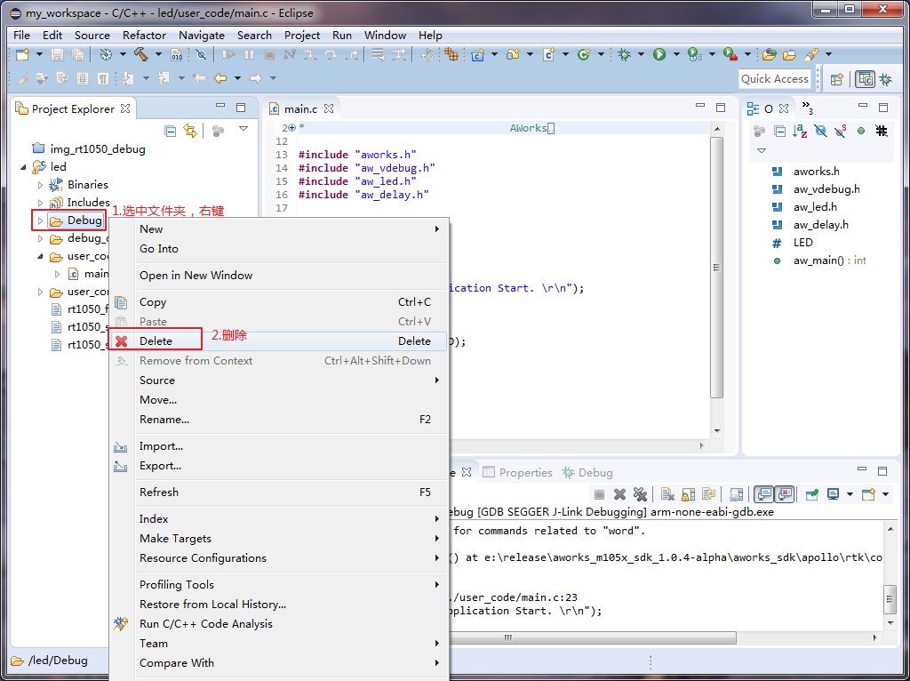

    删除led工程中的Debug文件夹

删除Debug文件夹之后，需要手动配置led工程的调试文件，在配置之前首先编译工程，编译操作参照 :numref:`{number} <.compile_project>` 小节。

编译完成后，点击【Debug Configurations...】，进入调试配置的界面，如 :numref:`a_picture_enter_debug` 所示。

.. _a_picture_enter_debug:

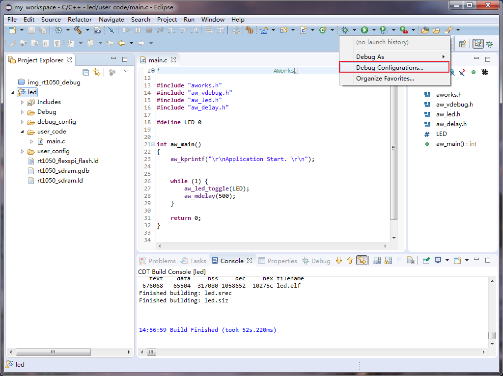

    选择进入调试配置

进入调试配置界面后如 :numref:`a_picture_double_click_debug` 所示，双击【GDB SEGGER J-Link Debugging】选项后，生成“led Debug”调试配置项。

.. _a_picture_double_click_debug:

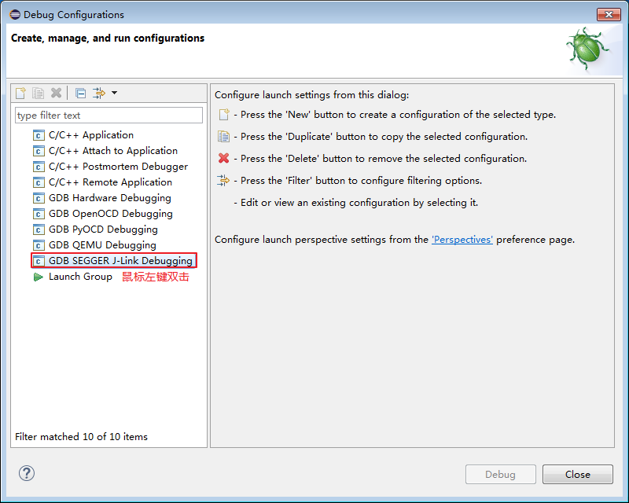

    双击生成led调试选项

接下来进行“led Debug”调试项的配置：

1、首先选中“led debug”调试项，选择【Main】界面进行配置，点击【Search Project...】选择调试文件，如 :numref:`a_picture_click_search_project` 所示。

.. _a_picture_click_search_project:

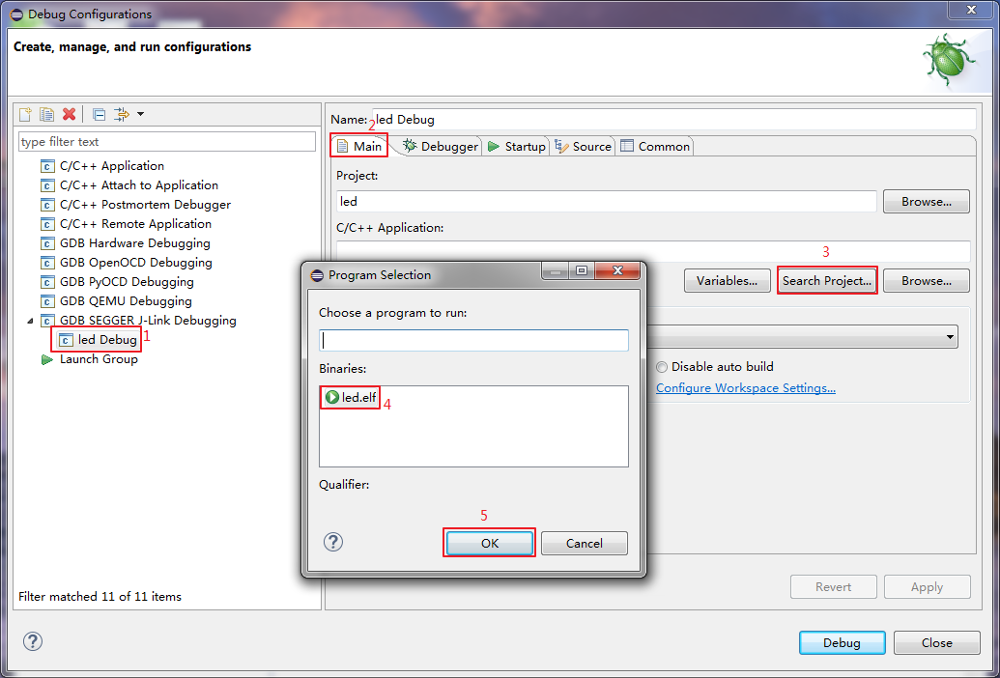

    选择调试文件

最后选择【Disable auto build】选项，点击 【Apply】保存配置，如 :numref:`a_picture_led_elf` 。

.. _a_picture_led_elf:

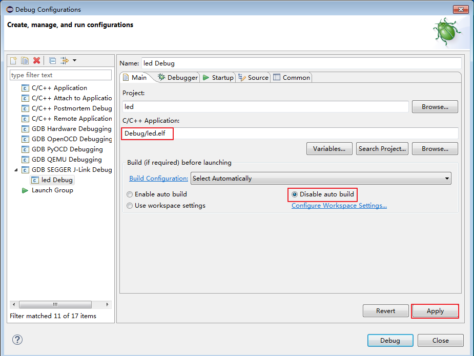

    点击Apply保存配置

2、【Debugger】界面配置，如 :numref:`a_picture_conf_debugger_window` ，首先在1处填写设备名称，其次去掉2处勾选，再次在3处输入"--command=easy_arm_rt1050_sdram.gdb"，最后保存配置。

.. _a_picture_conf_debugger_window:

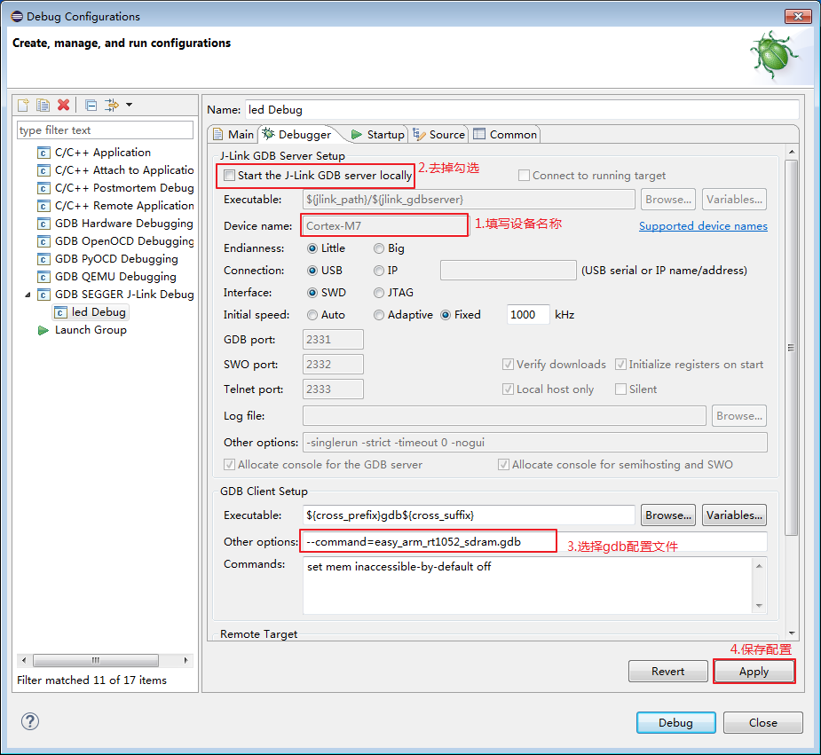

    配置Debugger界面

3.【Startup】界面配置，如 :numref:`a_picture_conf_startup_window` 所示。

.. _a_picture_conf_startup_window:

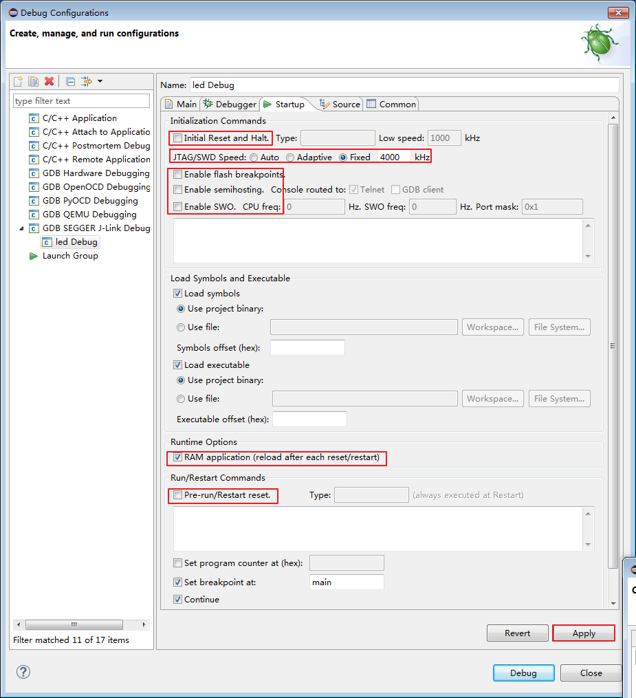

    配置Startup界面

4.【Source】界面保持默认设置。

5.【Common】界面配置，首先选择2处【Shared file:】选项，然后点击3处【Browse】按钮，选择“\\led\\debug_config”文件夹，点击【OK】退出，如 :numref:`a_picture_conf_common_window` 所示。

.. _a_picture_conf_common_window:

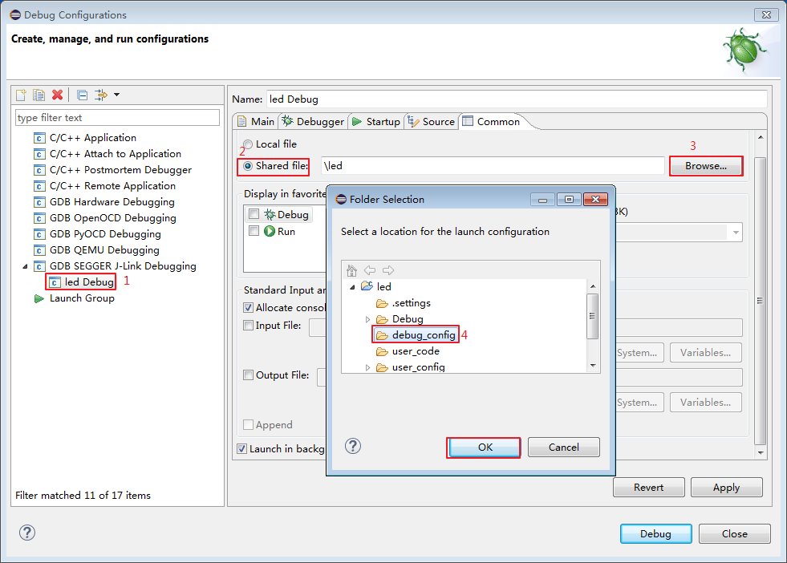

    配置Common界面

最后在【Debug】选项打勾，点击【Apply】保存配置，点击【Close】退出，如 :numref:`a_picture_close_led_debug` 。

.. _a_picture_close_led_debug:

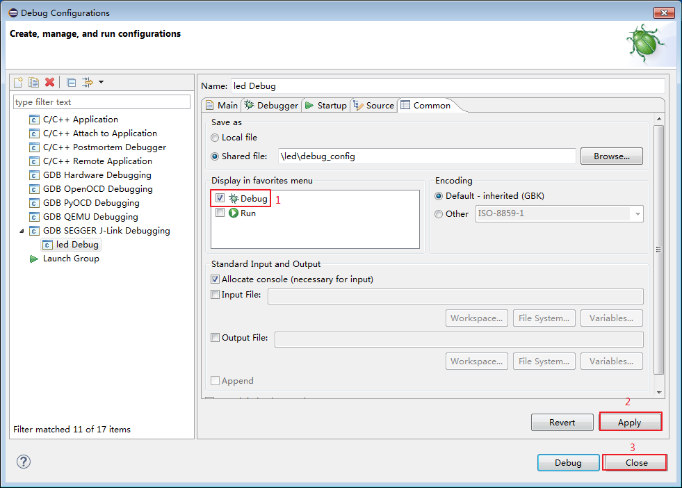

    配置Common界面

至此完成了从模板工程新建一个新工程，我们可以开始在新工程上开发自己的应用。